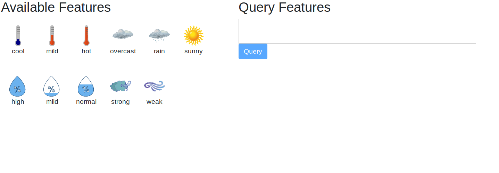
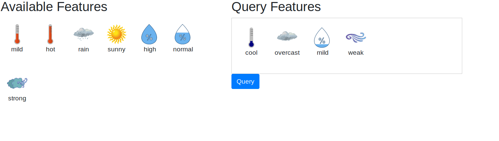
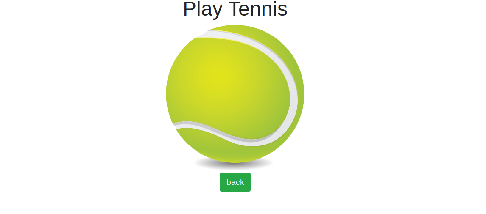

# query-machine-learning-model-exposed-in-an-api

This repo consist of a decision tree classifier trained on the famous play tennis dataset. The classifier and an AngularJS web app is hosted in a Flask application in a Docker container. The AngularJS web app provides the ability to drag features from a list of available features to a drop box. Once 4 distinct feature types are added to the drop box a user clicks the query button. This action sends a REST post request to the server. The server sends the provided features through the decision tree classifier and returns a classification to the client. The web app redirects to a play tennis or don't play tennis page depending on the classification returned from the server.

## Data Preprocessing

In the [preprocessing](preprocessing) folder you will find [preprocess.py](preprocessing/preprocess.py). In the file, the dataset is label encoded with the scikit-learn LabelEncoder. For each feature/column, the string values are updated to int values. Each unique string value being assigned a unique number.

### Encoded Mapping

```
overcast=0
rain=1
sunny=2
cool=0
hot=1
mild=2
high=0
mild=1
normal=2
strong=0
weak=1
no=0
yes=1
```

### Sample Example:

`sunny,hot,high,weak,no` is converted to `2,1,0,1,0`

# Screenshots







## Classifier Decision Graph


## Developer

### Build

#### AngularJS

This assumes you have angular cli, npm, and node installed.

Navigate to the [web-app](web-app) directory. Run the following commands.

```npm install ```

``` ng build --prod ```

#### Docker

This assumes you have docker installed.

Navigate to the root directory. Run the following command.

``` sudo docker build . -t play-tennis:v1 ```

### Host

```  sudo docker run -p 5000:5000 -dit play-tennis:v1 ```

Navigate to localhost:5000 in your browser.
